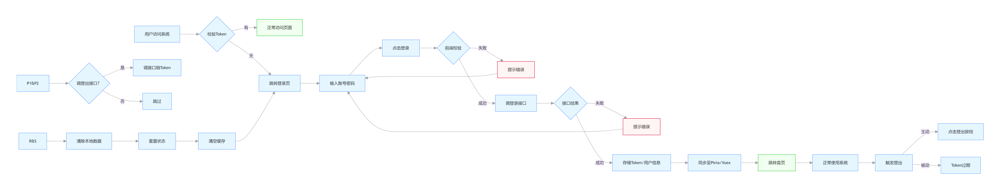

> 来自gemini生成

## 登录流程全景图

1.  提交表单：校验用户名密码。
2.  获取 Token：后端验证成功后返回 Token（通常是 JWT）。
3.  存储与拦截器配置：前端将 Token 存入 localStorage 或 Cookie，并配置 Axios 请求头。
4.  获取用户信息与权限：根据 Token 获取角色、权限列表及个人信息。
5.  动态生成路由：根据角色过滤路由表，并通过 router.addRoute 挂载，最后进入首页。

## 核心代码实现

    1. 第一步：封装 Axios 拦截器。你需要确保每个请求都自动带上 Token，并在 Token 过期时强制跳回登录页。

    ```js
    // src/utils/request.js
    import axios from 'axios'
    const service = axios.create({ baseURL: '/api', timeout: 5000 })

    // 请求拦截器
    service.interceptors.request.use(config => {
      const token = localStorage.getItem('token')
      if (token) {
        config.headers['Authorization'] = `Bearer ${token}`
      }
      return config
    })

    // 响应拦截器
    service.interceptors.response.use(response => {
      const res = response.data
      if (res.code === 401) {
        // Token 过期或无效
        localStorage.removeItem('token')
        location.reload() // 刷新页面触发路由守卫跳转登录
      }
      return res
    })
    ```


    2. 第二步 Vuex/Pinia 维护登录状态:登录操作建议放在 Store 里，方便全局调用。
    ```js
    // src/store/user.js (以 Pinia 为例)
    export const useUserStore = defineStore('user', {
      state: () => ({
        token: localStorage.getItem('token') || '',
        userInfo: null,
        roles: [],
      }),
      actions: {
        async login(loginForm) {
          const { data } = await apiLogin(loginForm) // 调用登录接口
          this.token = data.token
          localStorage.setItem('token', data.token)
        },
        async getInfo() {
          const { data } = await apiGetUserInfo() // 获取用户信息和角色
          this.userInfo = data
          this.roles = data.roles // 比如 ['admin']
          return data
        },
      },
    })
    ```


    3. 第三步 路由守卫（权限控制的核心）这是最关键的一步。在跳转任何页面前，判断用户是否有权访问。

    ```javascript
    // src/permission.js
    import router from './router'
    import { useUserStore } from './store/user'

    const whiteList = ['/login'] // 不重定向白名单

    router.beforeEach(async (to, from, next) => {
      const userStore = useUserStore()
      const hasToken = userStore.token

      if (hasToken) {
        if (to.path === '/login') {
          next({ path: '/' })
        } else {
          const hasRoles = userStore.roles && userStore.roles.length > 0
          if (hasRoles) {
            next()
          } else {
            try {
              // 1. 获取用户信息（包含角色）
              const { roles } = await userStore.getInfo()
              // 2. 根据角色生成可访问的动态路由（此逻辑通常在另一 Store）
              const accessRoutes = await permissionStore.generateRoutes    (roles)
              // 3. 动态添加路由
              accessRoutes.forEach(route => router.addRoute(route))
              // 4. 确保路由已挂载
              next({ ...to, replace: true })
            } catch (error) {
              // 发生错误（如 Token 非法），清空数据回登录页
              await userStore.resetToken()
              next(`/login?redirect=${to.path}`)
            }
          }
        }
      } else {
        if (whiteList.includes(to.path)) {
          next()
        } else {
          next(`/login?redirect=${to.path}`)
        }
      }
    })
    ```

## 雷点

页面刷新 404 动态路由是在运行时添加的，刷新后路由表会重置。必须在 router.beforeEach 中判断如果没有角色信息，重新执行一次动态加载逻辑。

## 登录接口清单

1. 验证码接口（可选）
2. 登录验证接口（login）
   - 返回tokenA
3. 获取用户信息接口（getUserInfo）
   - 这个接口健全用tokenA获取用户信息和角色
4. 获取权限与角色接口（GetPermissions/GetRoles）
   - 返回 role 角色列表（如 ['admin', 'editor']）。
   - 返回 button 权限列表（如 ['sys:user:add', 'sys:user:delete']）。
5. 获取动态路由/菜单接口

- 为什么“用户信息”和“路由列表”要分开？
  你可能会想：能不能在登录接口（接口 ②）里把用户信息和路由全返给前端？
  不建议这样做，原因有二：
  数据一致性：如果用户在操作期间，管理员修改了他的权限，分开请求可以确保用户刷新页面时，能通过 router.beforeEach 重新触发 GetRouters 接口获取最新权限，而不是一直沿用登录时的旧数据。
  原子性：登录接口只负责“发证”，用户信息接口负责“认人”，路由接口负责“分发任务”。这样后端代码更易于维护，也方便做多端适配（比如移动端 App 可能不需要路由列表，只需要用户信息）。
